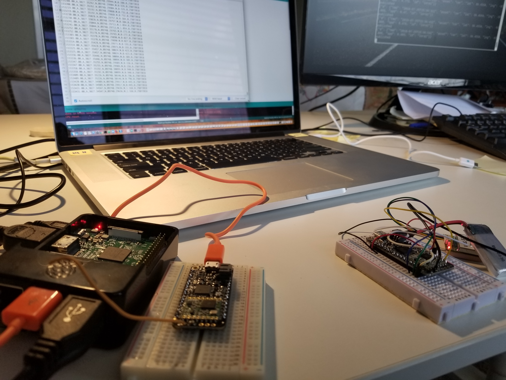
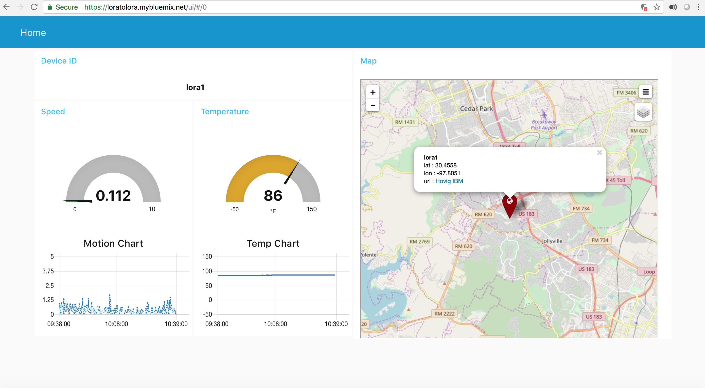

<b><u>Skill Level</u></b>: Beginner
 <b><u>N.B</u></b>: All services used in this repo are Lite plans.

# LoRa to LoRa Radio Communications

 

Adafruit Feather M0 RFM95 is a low range (LoRa) packet transceiver with a 900 MHz radio module. This is a great component for asset tracking (e.g. wildlife animals, pipes, sensors, buildings, etc.). 868 MHz or 915 MHz can be used for transmission/reception. We will set our radio frequency to 868 MHz in this project where the transmitting LoRa will send GPS data to the receiving LoRa. The receiver will pass the data to Raspberry Pi 3.

The Raspberry Pi 3 acts as a gateway device that will use MQTT to publish the data to IBM Cloud's Watson IoT Platform. From Watson IoT Platform, there's a lot can be done but we will mainly grab the data and display it on a dashboard.

The dashboard will mainly have a map with the GPS latitude and longitude, also will display the speed and the temperature from that same location.

Check out the post on [Medium](https://medium.com/@levanoni613/lora-to-lora-rpi-gateway-mqtt-watson-iot-platform-node-red-dashboard-b2fc473df6e2).

### Before you begin

* Create an IBM Cloud account if you don't have an existing one: [Sign up](https://console.ng.bluemix.net/registration/?target=/catalog/%3fcategory=watson).

## Setup steps

* Step 1 - [Hardware setup](steps/hw.md)
* Step 2 - [Watson IoT Platform instance setup on IBM Cloud](steps/iot.md)
* Step 3 - [Node-RED setup for dashboard display on IBM Cloud](steps/nodered.md)

## Links & documentations

* [Adafruit pinouts](https://learn.adafruit.com/adafruit-feather-32u4-radio-with-rfm69hcw-module/pinouts)
* [Register devices on Watson IoT Platform](https://developer.ibm.com/recipes/tutorials/how-to-register-devices-in-ibm-iot-foundation/)
